# Probee

* **Curso:** _Construye una single page app(SPA) multi-usuario consumiendo data remota_
* **Unidad:** _Producto Final_

***

Se desarrolló una app web e-commerce, bajo los principios de SPA (Single Page Application). Se aplicaron los siguientes conceptos.

* Templating
* Routing (URLs)
* DOM & Event Handling (State)
* Patrón de arquitectura de software (MV*)

Se usaron las siguientes tecnologías:

* HTML5
* CSS
* ES6
* jQuery
* Bootstrap
* Responsive Web Design
* Consumo API PayPal
* Consumo API Mercado Libre

**Información sobre este proyecto**

Probee es un marketplace en el cual los fabricantes/proveedores pueden ofrecer sus productos a comercializadores y mayoristas.

**Flujo del programa**

1. El comprador entra a la página principal y busca directamente el artículo que le interesa.

2. Al hacer click en buscar, aparecen diferentes fabricantes/proveedores con el producto que coincide con la búsqueda.

3. Se hace click en el producto/proveedor que se esta interesado.

4. Se muestra información específica del producto, la puntuación que tiene de otros usuarios que han comprado, material, precio, garantía etc.

5. Si hay una empresa que esté interesada en formar parte del directorio de proveedores, tiene que hacer click en el botón que dice " Ingresa Aquí " en el anuncio que se encuentra situado a la derecha de la página.

6. Al hacer click en el anuncio se va a abrir un modal con los dos tipos de suscripciones con la descripción de lo que incluye cada una.

7. Si la empresa quiere ser miembro premium va hacer click en el botón de PayPal para hacer el pago directo de su suscripción al directorio.

### Visualización desktop

_Página principal_

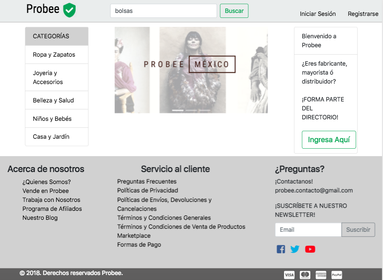

_Búsqueda del artículo_

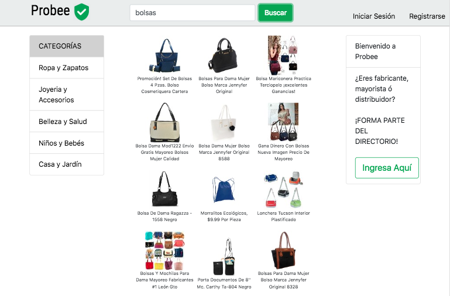
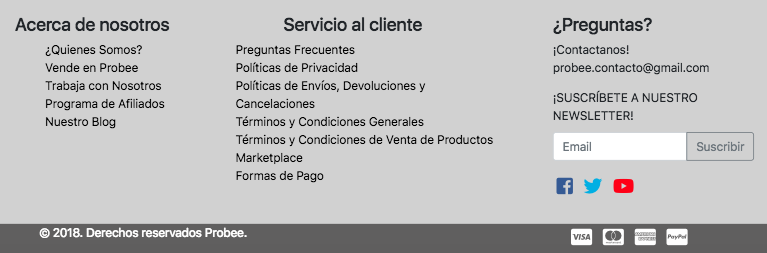

_Información del artículo_

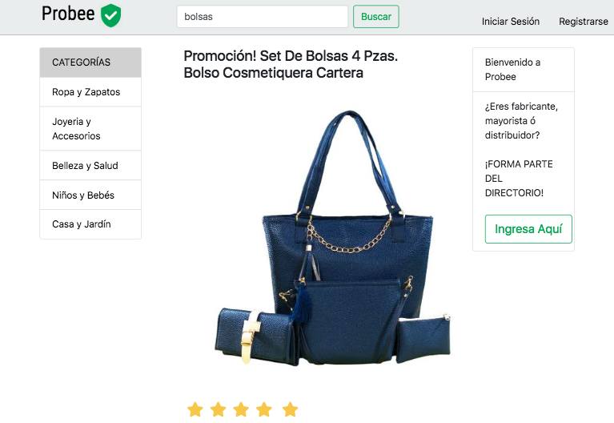
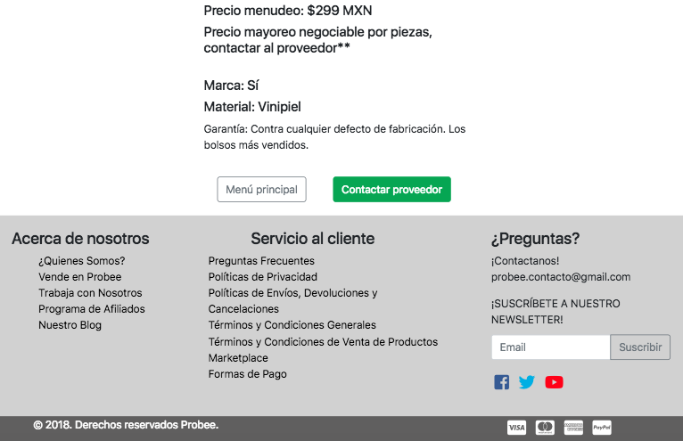

_Suscripción al directorio de proveedores_

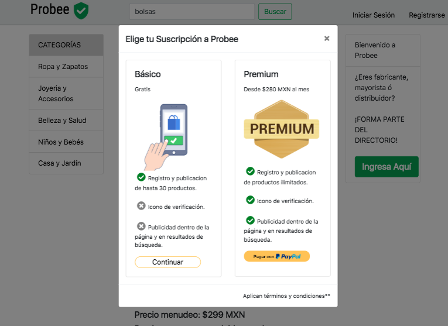

_Confirmación de la suscricpión_

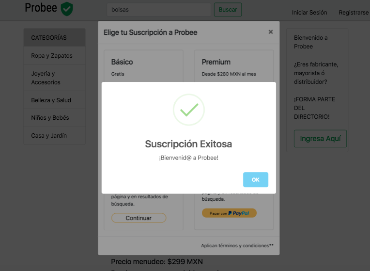

## Visualización mobile 

_Página principal_

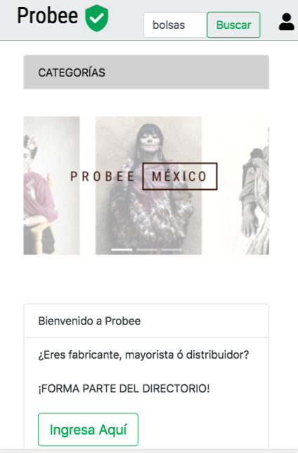

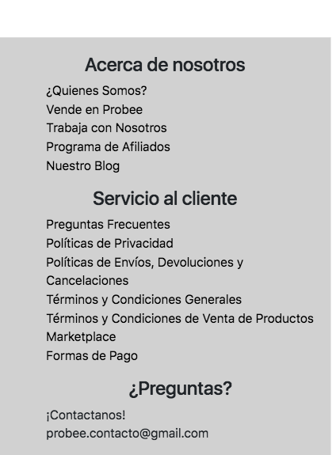

_Búsqueda del artículo_

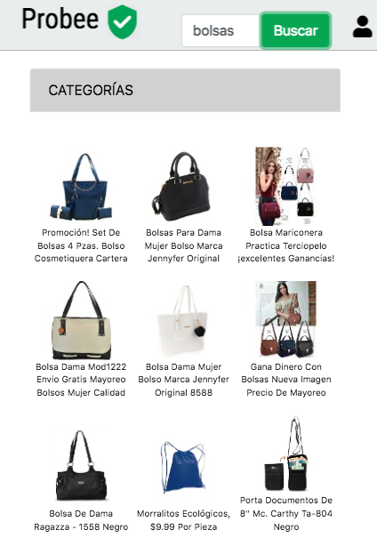

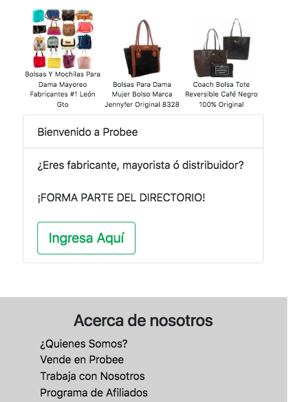

_Información del artículo_

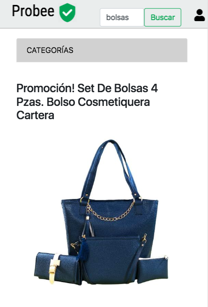

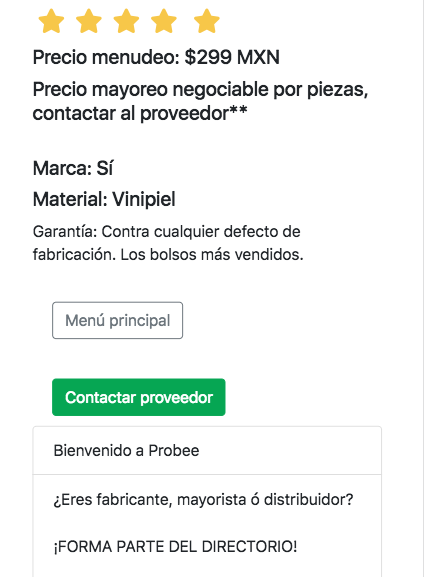

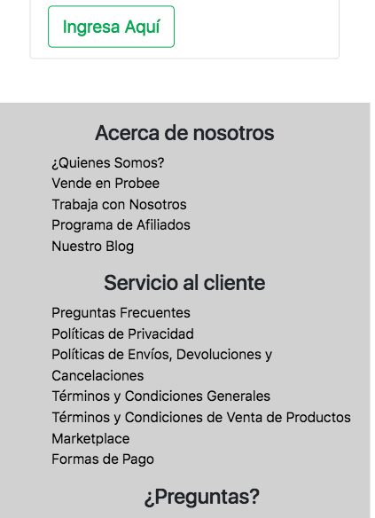

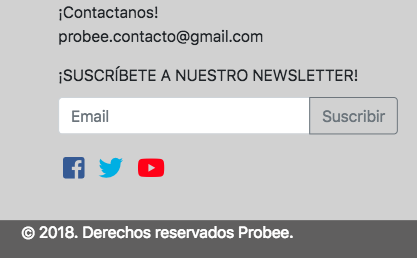

_Suscripción al directorio de proveedores_

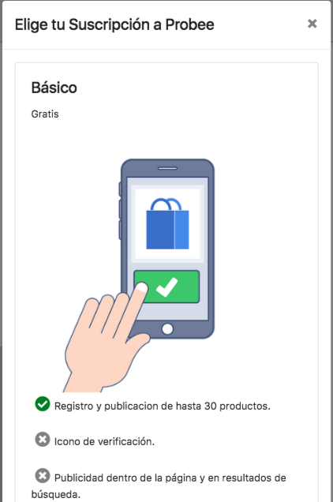

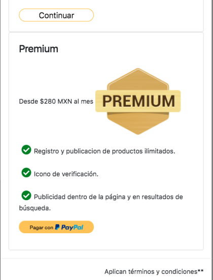

_Confirmación de la suscricpión_

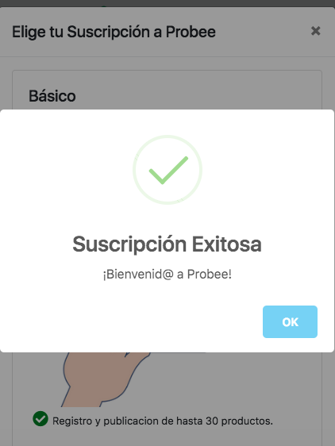

## Visualización tablet

_Página principal_

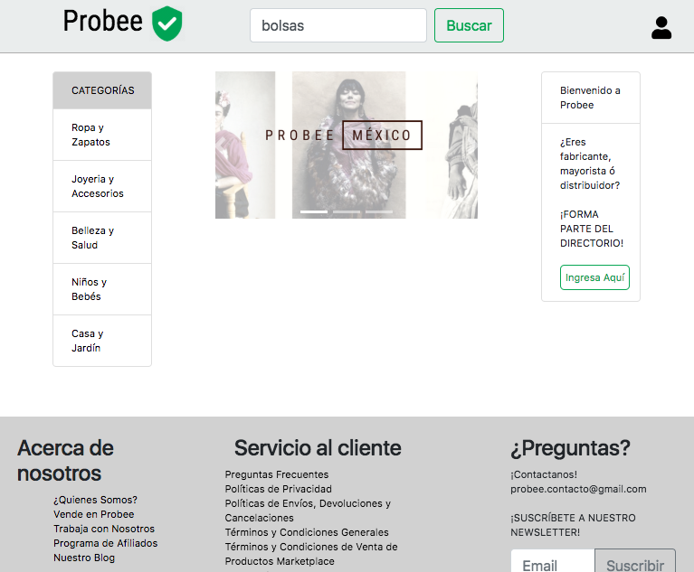
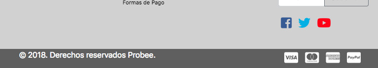

_Búsqueda del artículo_

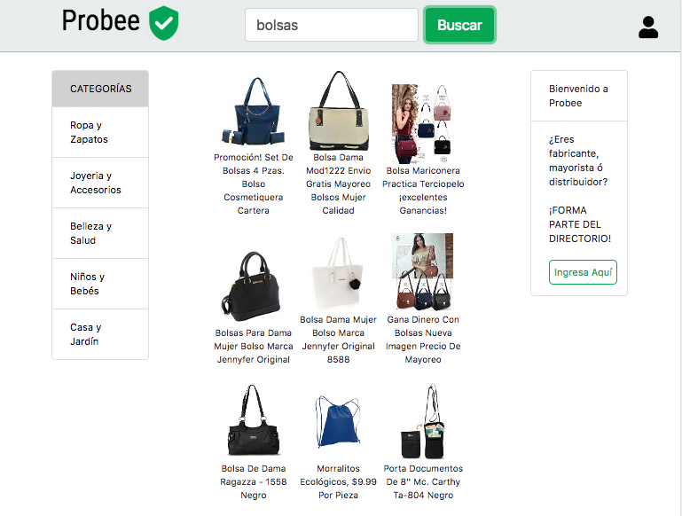
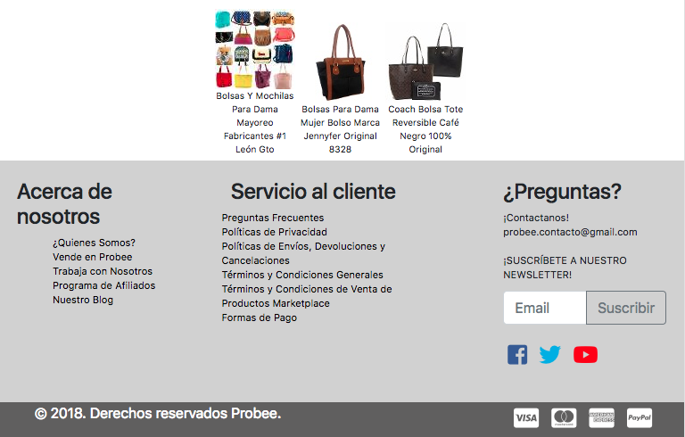

_Información del artículo_

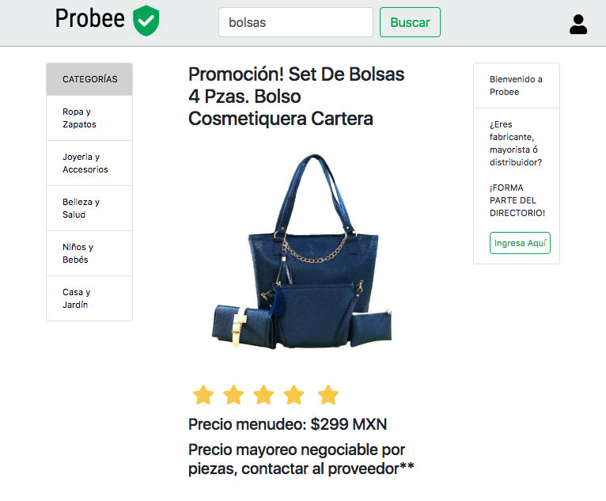
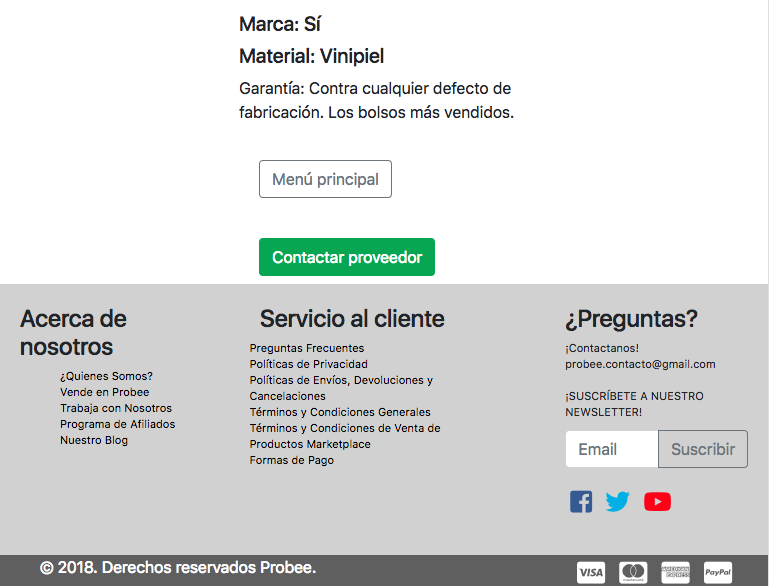

_Suscripción al directorio de proveedores_

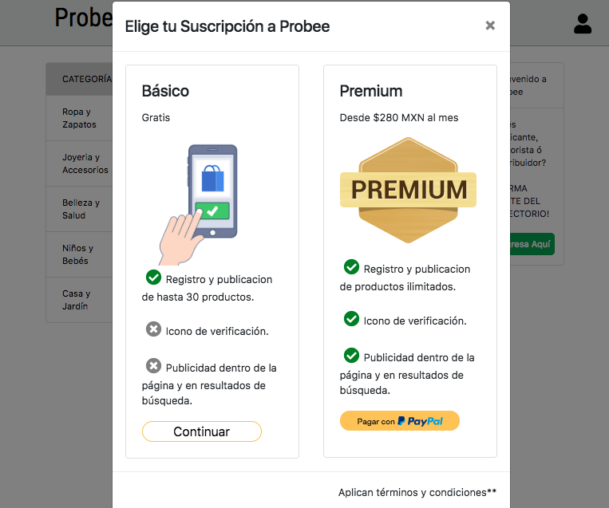

_Confirmación de la suscricpión_

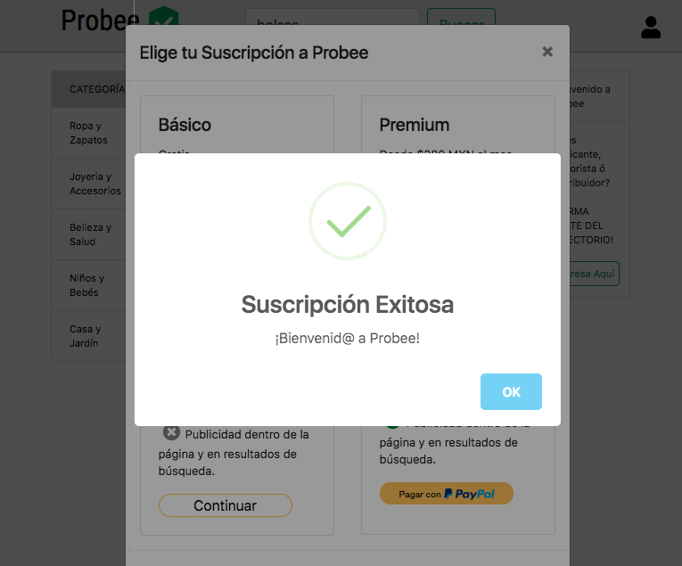
