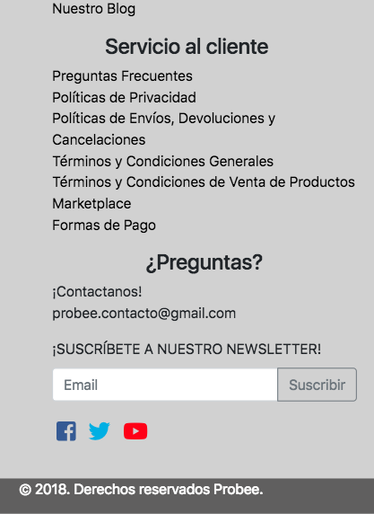

# Probee

* **Curso:** _Construye una single page app(SPA) multi-usuario consumiendo data remota_
* **Unidad:** _Producto Final_

***

En este reto se desarrolló una app web e-commerce, bajo los principios de SPA (Single page Application). Se aplicaron los siguientes conceptos.

* Templating
* Routing (URLs)
* DOM & Event Handling (State)
* Patrón de arquitectura de software (MV*)

Se usaron las siguientes tecnologías:

* HTML5
* CSS
* ES6
* jQuery
* Bootstrap
* Responsive Web Design
* Consumo API PayPal
* Consumo API Mercado Libre

**Información sobre este proyecto**

Probee es un marketplace en el cual los proveedores pueden ofrecer sus productos a comercializadores y mayoristas.

**Flujo del programa**

1. El comprador entra a la página principal y busca directamente el articulo que esta buscando.

2. Al hacer click en buscar, aparecen los principales proveedores con el producto que coincide con la búsqueda.

3. Se hace click en el producto/proveedor en el cual esta interesado.

4. Se muestra información específica del producto, la puntuación que tiene de otros usuarios que han comprado, material, precio, garantía etc.

5. Si hay una persona/empresa que esté interesada en formar parte del directorio, tiene que hacer click en el botón que dice 'Ingresa Aquí' en el anuncio que se encuentra situado a la derecha de la página.

6. Al hacer click en el anuncio se va a abrir un modal con los dos tipos de suscripciones y lo que incluye cada una.

7. Si el usuario quiere ser miembro premium va hacer click en el botón de paypal para hacer el pago directo de su suscripción a nuestra lista.

### Visualización desktop

## Visualización mobile 

## Visualización tablet

